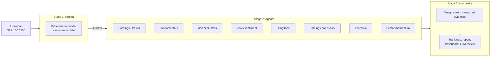

# Auto-Researcher

[](.github/workflows/ci.yml)

[](LICENSE)

A research platform for building equity signals and testing them honestly.

* **Point-in-time data pipelines** for prices, earnings (announcement dates
  inferred from SEC filings), news sentiment, filings and call transcripts.
* **A leakage-safe evaluation toolkit**: a purged walk-forward harness, an
  event-driven strategy simulator, causality and leakage tests, deflated
  statistics and random-portfolio baselines.
* **Analyst tooling**: a multi-agent pipeline that researches a shortlist of
  stocks (filings, earnings calls, insider trades, news, fundamentals) with a
  Streamlit dashboard and optional LLM review.
* **A research log**: every study below is reproducible from `scripts/`, with
  its report in [docs/results/](docs/results/).

> [!NOTE]
> Earlier versions of this README advertised an ML IC of +0.145, an
> out-of-sample Sharpe of 3.53 and a PEAD IC of +0.22. All three were evaluation
> bugs (label leakage, a "holdout" that was not one, earnings events dated
> before the announcement). [docs/AUDIT.md](docs/AUDIT.md) explains each one and
> how the toolkit now prevents it.

## Research log

| Study | Question | Finding | Report |
| --- | --- | --- | --- |
| Audit | Were the published results real? | No: leakage, a fake holdout and look-ahead event dates. Purging alone moves the ML IC from +0.112 to -0.011 | [AUDIT.md](docs/AUDIT.md) |
| ML ranker | Does the XGBoost screen rank stocks? | No. Purged IC -0.015 (t -0.85) over 105 months; 12-month momentum does as well | [walkforward.md](docs/results/walkforward.md) |
| Features, round 1 | Do 13 published factors, sector-neutral targets or 500 stocks help? | No. Every candidate's IC was between -0.027 and +0.0003; holdout no better than momentum | [feature_research.md](docs/results/feature_research.md) |
| Features, round 2 | Do point-in-time earnings features help the ML model? | No. Surprises predict drift in event time (IC +0.03, t 2.5 over 50 quarters) but too weakly for a monthly ranking | [earnings_feature_research.md](docs/results/earnings_feature_research.md) |
| Earnings drift | Does drift follow surprises vs. analyst consensus? | Yes, in 9 quarters: 40-day drift IC +0.137 (t 3.1), big beats minus big misses +5.2% | [pead_event_study.md](docs/results/pead_event_study.md) |
| Earnings strategy | Is the drift tradeable? | Analyst surprises: long-short +10.7%/yr gross, Sharpe 1.2 (t 2.0) over 2.3 years, +4.8% net. Year-over-year surprises: about +1%/yr gross, negative net | [earnings_event_strategy.md](docs/results/earnings_event_strategy.md) |
| Sentiment | Does the sentiment agent's FinBERT signal predict returns? | No. All 8 pre-specified signal/horizon pairs \|t\| < 1.6; the earlier +0.02 IC came from a leaky backtest | [sentiment_audit.md](docs/results/sentiment_audit.md) |
| Fundamentals, round 3 | Do six published fundamental factors work point-in-time in large caps? | Mostly no. Only accruals passed (IC +0.020, t 2.3; holdout same sign). Gross profitability, asset growth, issuance, FCF and EBIT yields and their composite did not | [fundamental_factors.md](docs/results/fundamental_factors.md) |
| ML valuation gap | Does an ML growth forecast plus DCF find mispriced stocks? | Not established. The forecast beats naive growth estimates (rank corr. 0.35 vs 0.18, t 2.2), and the gap had the best IC (+0.029) and holdout portfolio (+7%/yr vs equal weight), but did not beat a naive-forecast gap by the pre-registered margin | [fundamental_factors.md](docs/results/fundamental_factors.md) |

**Current best lead:** post-earnings drift measured against analyst consensus.
It agrees with decades of research, but 2.3 years is too short to rely on. A
longer consensus history (Alpha Vantage, back to ~1996) is downloading daily via
`scripts/download_av_earnings.py`; the strategy picks it up at 100 stocks.

## Evaluation toolkit

### Walk-forward harness

Any object with `fit(X, y)` / `predict(X)` can be scored:

```python
from auto_researcher.backtest.walk_forward import WalkForwardConfig, run_walk_forward
from auto_researcher.backtest.baselines import FeatureScoreModel
from auto_researcher.screening import UNIVERSES, build_feature_panel, fetch_prices

prices = fetch_prices(UNIVERSES["sp100"](), lookback_days=10 * 365)  # wide panel incl. SPY
features = build_feature_panel(prices, benchmark="SPY")               # (date, ticker) x features

result = run_walk_forward(
    features, prices,
    model_factory=lambda: FeatureScoreModel("tech_resid_mom_252"),
    config=WalkForwardConfig(horizon=21, rebalance_every=21, top_k=10, cost_bps=10),
)
print(result.summary()["ic_mean"], result.summary()["net_ir_vs_equal_weight"])
```

* **Timing.** Features at the close of *t*, entry at the close of *t + lag*,
  label from *t + lag* to *t + lag + horizon*.
* **Purging.** Training rows are used only if their labels were realized before
  the test date (in trading days). On random-walk prices the legacy split lets a
  memorizing model reach IC +0.4; purged, it is 0
  ([leakage canary](tests/test_walk_forward.py)).
* **Honest comparisons.** Spearman IC with Newey-West t-stats; a daily top-k
  portfolio net of costs next to SPY and the equal-weight universe; information
  ratios deflated for the number of variants tried; the Sharpe percentile
  against random portfolios; optional sector-neutral training targets.

### Other tools

| Tool | Module |
| --- | --- |
| Event-driven long/short simulator with causal percentile thresholds | `backtest/event_strategy.py` |
| Published price/volume factors (momentum, 52-week high, beta, MAX, seasonality, sector momentum, ...) | `features/alpha_factors.py` |
| Earnings events: announcement dates from SEC 8-K/10-Q filings, time-series surprises | `features/earnings_events.py` |
| Point-in-time news-sentiment signals | `features/news_signals.py` |
| Point-in-time fundamentals from SEC XBRL filings (first-reported, usable after filing, TTM) | `data/sec_fundamentals.py` |
| Market cap with split handling, EV, value/quality ratios, reverse DCF | `features/valuation.py` |
| Purged walk-forward splits, deflated Sharpe | `validation/` |
| Guard against event data keyed on fiscal period ends | `validation/event_dates.py` |
| Evidence-based weights (signed, sample-size-shrunk ICs) | `composite.py` |

Every feature builder has a causality test: perturbing future prices or
filings must not change any earlier value
([tests/test_feature_causality.py](tests/test_feature_causality.py)). The
SEC-based announcement dates were checked against an independent source:
exact 71% of the time and two or more days early only 2.9%
(`features/earnings_events.py`).

## Analyst pipeline and dashboard



The pipeline gathers and summarizes evidence about a shortlist for a human
analyst: what the filings, earnings calls, insider trades and news say, where
the agents disagree, and an LLM red-team review. Stage 1 has no measured skill
(see the research log), so treat it as a filter that decides which names the
agents read. The composite weights each agent by its out-of-sample evidence:

| Agent | Evidence | Composite weight |
| --- | --- | --- |
| Earnings drift (PEAD) | Analyst-surprise drift IC +0.090, 9 quarters: tentative | Largest (22%) |
| ML screen | IC -0.025 over 105 months | Zero |
| Sector momentum | IC -0.030 over 33 months | Zero |
| News sentiment | Point-in-time audit: IC +0.016 over 24 months, no edge | Slightly below prior (12%) |
| Fundamentals | Pre-audit evidence had look-ahead and is ignored; point-in-time factors are tested separately in round 3 | Prior (13%) |
| Insider clusters, filing tone, earnings-call quality, thematic | Not yet measured | Prior (13%) |

Weights come from `data/agent_ic.json`, written by
`scripts/calibrate_ic_weights.py` from the reports in `docs/results/`.

## Quick start

```bash
git clone https://github.com/AndrewFSee/auto_researcher.git
cd auto_researcher
python -m venv .venv && source .venv/bin/activate   # Windows: .venv\Scripts\activate

pip install -e ".[dev,dashboard]"   # add nlp, llm, research as needed
cp .env.example .env                # API keys; SEC_API_USER_AGENT needs a real contact
pytest -q
```

| Extra | Adds |
| --- | --- |
| `nlp` | torch, transformers, sentence-transformers, ChromaDB (sentiment, filings, transcripts) |
| `llm` | litellm, gpt-researcher (LLM review, deep research) |
| `dashboard` | Streamlit |
| `research` | matplotlib, aiohttp (news scrapers) |

### Common commands

```bash
# Dashboard and analyst pipeline
streamlit run app.py
python scripts/run_ranking_low_memory.py --universe sp100 --ml-top 25 --final-top 10
python scripts/run_ranking_low_memory.py --llm-review

# Research studies (each writes docs/results/<name>.md/.json)
python scripts/ml_walkforward_backtest.py --universe sp100 --lookback-years 10
python scripts/feature_research.py
python scripts/earnings_feature_research.py
python scripts/earnings_event_strategy.py
python scripts/sentiment_audit.py
python scripts/calibrate_ic_weights.py          # refresh agent weights from the reports
```

The research scripts download prices (yfinance), S&P 500 membership
(Wikipedia) and SEC filing/EPS histories (DefeatBeta) into
`data/research_cache/` on first run. `data/` is local and not in git. Pipeline
outputs go to `data/ranking_results/` (override with
`AUTO_RESEARCHER_RESULTS_DIR`). Docker: `docker compose up --build` serves the
dashboard on port 8501. See [scripts/README.md](scripts/README.md) for every script.

## Project layout

```
src/auto_researcher/
├── backtest/      # walk_forward.py (harness), event_strategy.py, baselines, metrics
├── validation/    # Purged splits, deflated Sharpe, event-date checks
├── features/      # Technical, alpha factors, earnings events, news signals, targets,
│                  # point-in-time fundamental factors, valuation and reverse DCF
├── data/          # Prices (with offline cache), SEC point-in-time fundamentals,
│                  # FMP / Alpha Vantage earnings, news scraper, vector stores
├── agents/        # Sentiment, LLM review, deep research
├── models/        # PEAD, quality-value, insider cluster, filing tone, earnings-call quality,
│                  # sector momentum and rotation, early adopter, XGBoost ranker, growth forecast
├── screening.py   # Stage 1 screen
└── composite.py   # Evidence-based agent weights
scripts/           # Pipeline, research studies and data ingestion (see scripts/README.md)
tests/             # Unit, leakage, causality and accounting tests
docs/              # AUDIT.md and the research reports (docs/results/)
app.py             # Streamlit dashboard
```

## Limitations

* **Survivorship bias.** Universes are current constituent lists. The S&P 500
  studies add each stock only from its index add date, but companies that later
  left the index are missing. Compare against the equal-weight portfolio of the
  same names, and treat absolute returns as optimistic.
* **Short histories.** Point-in-time analyst consensus is available only from
  late 2023, and dense news coverage only from 2024.
* **Unmeasured agents.** Insider, filing-tone, earnings-call and thematic agents
  have no out-of-sample measurement yet.
* **Research software.** Nothing here is investment advice.

## References

| Topic | Papers |
| --- | --- |
| Backtest overfitting, purged CV | López de Prado (2018); Bailey & López de Prado (2014) |
| Earnings drift | Ball & Brown (1968); Bernard & Thomas (1989); Brandt et al. (2008); Martineau (2021) |
| Momentum, reversal, other factors | Jegadeesh (1990); Jegadeesh & Titman (1993); George & Hwang (2004); Heston & Sadka (2008); Bali, Cakici & Whitelaw (2011); Frazzini & Pedersen (2014) |
| Text and sentiment | Loughran & McDonald (2011); Garcia (2013) |
| Insider trading | Lakonishok & Lee (2001); Cohen, Malloy & Pomorski (2012) |
| Portfolio construction | Markowitz (1952); Ledoit & Wolf (2004); Grinold & Kahn (2000) |

## License

MIT; see [LICENSE](LICENSE).
